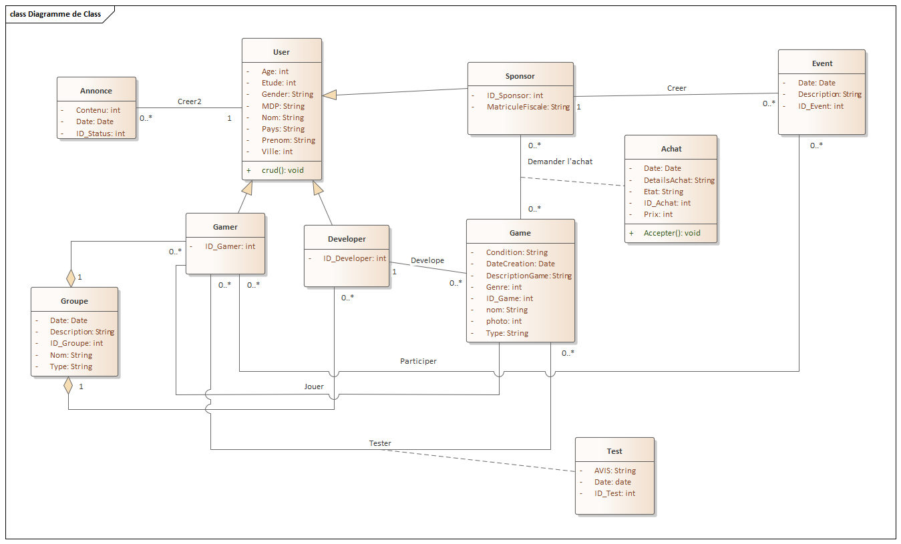
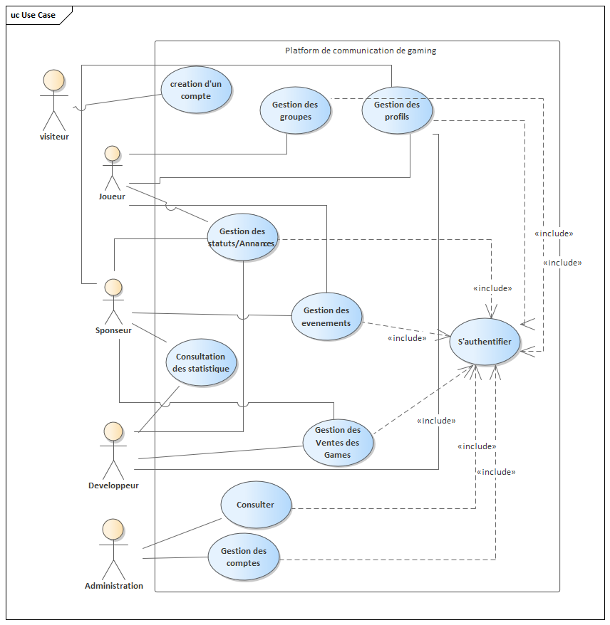

  

<h6 align="center">
  
</h6> 
 
<h1 align="center"> Symfony Application 5.3.x </h1>

<h4 align="right"> This for the first part of this social media which had the administration part </h4>
<h4 align="right"> I start with the part of adminstration of web site with adminstrator and sponsor part </h4>
<h4 align="right"> it's still with the gamer and developer environment</h4>
<h5 align="right"> (had the template but integration with the data base not yet)</h5>

it's a project for social media for gamer to find others
<h2> * There are four profiles of people who can use this social media : </h2> 

- Adminstrator  
- Gamer  
- Game Developer  
- Sponsors  

<h2> * Administrator: </h2>  
- Web site adminstration (Ex: Accounts managment, content managment ...)

<h2> * Gamer: </h2>  
- He can create an account and start create or applied to join a group of gamers.
- Add content.
- Test games and give a review.
- Join to an event.

<h2> * Game developer: </h2>  
- He can create an account and start create or applied to join a group of developer.
- Add content.
- Deploye games which he developed and read gamers review.
- He can make the game for sponsor to buy it.

<h2> * Sponsors: </h2>  
- Add content.
- Create events.
- Applied to buy a game.

<h2> About the application: (FR-fr) </h2> 

<h3 align="center"> ** Class Diagram ** </h3>   

<h3 align="center"> ** Use Case Diagram ** </h3>   

<h3 align="center"> ** Global application architecture  ** </h3>   

<h3 align="center"> ** Environment of development ** </h3>   
Symfony 5.3.X

